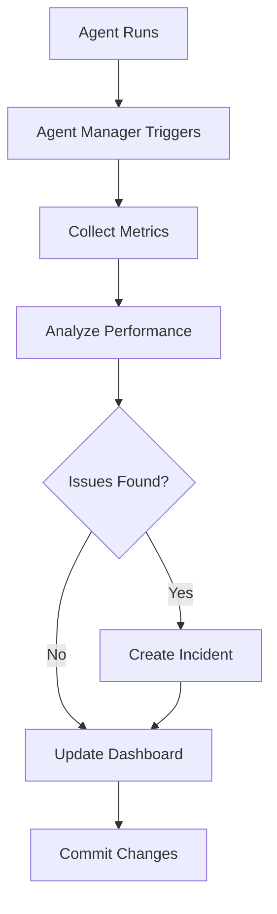

# 🤖 Advanced AI Agents - Complete Guide

## 🎯 Agent Manager (Meta-Agent)

### Overview

The **Agent Manager** is a meta-agent that monitors, manages, and coordinates all other AI agents in your repository. It acts as a supervisor, ensuring all agents run smoothly and efficiently.

### Key Features

1. **🔍 Agent Monitoring**
   - Tracks all agent workflow runs
   - Monitors success/failure rates
   - Identifies problematic agents
   - Provides real-time health status

2. **📊 Performance Analytics**
   - Calculates success rates
   - Tracks run durations
   - Identifies bottlenecks
   - Generates trend analysis

3. **🔧 Auto-Remediation**
   - Creates incident issues for failures
   - Alerts on multiple failures
   - Suggests fixes automatically
   - Prevents cascading failures

4. **📈 Dashboard Generation**
   - Auto-updates every 6 hours
   - Shows all agent statistics
   - Displays trends and patterns
   - Provides quick links

5. **📊 Weekly Reports**
   - Sent every Monday
   - Summarizes agent performance
   - Highlights issues
   - Provides recommendations

### Triggers

- **After any agent run:** Monitors completion status
- **Every 6 hours:** Updates dashboard
- **Monday 9 AM:** Generates weekly report
- **Manual:** `gh workflow run agent-manager.yml`

### Configuration

File: `.github/agents/agent-manager.config.json`

```json
{
  "monitoring": {
    "checkInterval": "6h",
    "monitoredAgents": [
      "Code Review Agent",
      "Documentation Agent",
      "Performance Agent",
      "PR Commit Review Agent",
      "Environment Check Agent"
    ]
  },
  "autoRemediation": {
    "createIncidentIssue": true,
    "failureThreshold": 5,
    "timeWindow": "24h"
  }
}
```

### Outputs

1. **AGENT_DASHBOARD.md** - Real-time agent status
2. **Incident Issues** - Auto-created when failures > 5
3. **Weekly Summary** - Posted to GitHub Actions summary

### How It Works



---

## 🤖 PR Commit Review Agent

### Overview

The **PR Commit Review Agent** automatically reviews all commit messages in pull requests, ensuring they follow best practices and conventional commit format.

### Key Features

1. **📝 Commit Format Validation**
   - Checks conventional commit format
   - Validates type, scope, description
   - Ensures proper capitalization
   - Checks subject line length

2. **📊 Quality Scoring**
   - Scores commits 0-100%
   - Assigns grade (A+ to D)
   - Tracks good vs bad commits
   - Provides actionable feedback

3. **🔗 Issue Linking**
   - Checks for issue references
   - Suggests linking keywords
   - Validates reference format
   - Encourages best practices

4. **⚠️ Anti-Pattern Detection**
   - Flags WIP commits
   - Detects fixup commits
   - Warns about long subjects
   - Checks for breaking changes

### Triggers

- **Pull Request Opened:** Reviews all commits
- **Pull Request Updated:** Re-reviews commits
- **Pull Request Review:** Additional checks

### Conventional Commit Format

```
type(scope): description

[optional body]

[optional footer]
```

**Valid Types:**
- `feat`: New feature
- `fix`: Bug fix
- `docs`: Documentation
- `style`: Formatting
- `refactor`: Code restructuring
- `perf`: Performance improvement
- `test`: Tests
- `build`: Build system
- `ci`: CI/CD
- `chore`: Maintenance
- `revert`: Revert previous commit

**Examples:**

✅ Good:
```
feat(api): add video transcription endpoint
fix(ui): resolve button alignment on mobile
docs(readme): update installation instructions
```

❌ Bad:
```
updated stuff
WIP: working on feature
Fix bug.
FEATURE: new thing
```

### Configuration

File: `.github/agents/commit-review.config.json`

```json
{
  "conventionalCommits": {
    "enabled": true,
    "subjectMaxLength": 72,
    "subjectMinLength": 10
  },
  "scoring": {
    "passThreshold": 70,
    "warningThreshold": 85,
    "excellentThreshold": 95
  },
  "checks": {
    "preventWIP": true,
    "preventFixup": true
  }
}
```

### Sample Output

```markdown
## 🤖 PR Commit Review Agent

### 📊 Commit Quality Score: **85%** (B+ Good)

---

### 📈 Statistics

| Metric | Value |
|--------|-------|
| Total Commits | 5 |
| ✅ Well-formatted | 4 |
| ❌ Needs improvement | 1 |
| 👥 Authors | 1 |

### ❌ Issues Found

❌ **Bad commit format**: `abc1234` - updated files
   - Should follow: `type(scope): description`
   - Example: `feat(api): add video summary endpoint`

### 💡 Suggestions

💡 **Consider adding issue reference**: `def5678`
   - Add `Closes #123` to link this PR to an issue

---

### 📚 Commit Message Guidelines

**Format:** `type(scope): description`

See: https://www.conventionalcommits.org/
```

### Best Practices

1. **Write Clear Commit Messages**
   ```bash
   # Good
   git commit -m "feat(auth): add OAuth2 authentication"
   
   # Bad
   git commit -m "auth stuff"
   ```

2. **Use Proper Types**
   - `feat`: For new features
   - `fix`: For bug fixes
   - `docs`: For documentation only

3. **Keep Subject Short**
   - Under 72 characters
   - Capitalize first word
   - No period at end

4. **Link to Issues**
   ```bash
   git commit -m "fix(api): handle null responses

   Fixes #123"
   ```

---

## 🔍 Environment Check Agent

### Overview

The **Environment Check Agent** validates all environment files, configuration files, and ensures your project is properly configured for all environments.

### Key Features

1. **🔐 Environment Variable Validation**
   - Checks for required variables
   - Detects missing values
   - Flags placeholder values
   - Ensures consistency

2. **🔒 Security Scanning**
   - Detects hardcoded secrets
   - Checks .gitignore rules
   - Validates secret patterns
   - Prevents exposure

3. **⚙️ Configuration Validation**
   - Validates package.json
   - Checks tsconfig.json
   - Runs security audits
   - Ensures consistency

4. **📝 Auto-Generation**
   - Creates .env.example
   - Updates on changes
   - Includes comments
   - Documents all variables

5. **📊 Reporting**
   - Generates environment reports
   - Posts on pull requests
   - Tracks configuration status
   - Provides recommendations

### Triggers

- **Config File Changes:** On push/PR
- **Weekly Schedule:** Monday 12 AM
- **Manual:** `gh workflow run environment-check-agent.yml`

### Checked Files

- `.env*` - All environment files
- `package.json` - Dependencies
- `tsconfig.json` - TypeScript config
- `vite.config.ts` - Build config
- `vitest.config.ts` - Test config
- `tailwind.config.js` - Styles config

### Required Variables

The agent checks for these essential variables:

```bash
# Application
VITE_APP_NAME=YouTube Video Summarizer
VITE_APP_VERSION=1.0.0
NODE_ENV=development

# API Configuration
VITE_API_URL=http://localhost:3001
PORT=3001

# OpenAI
VITE_OPENAI_API_KEY=your_key_here
OPENAI_API_KEY=your_key_here

# YouTube
VITE_YOUTUBE_API_KEY=your_key_here
YOUTUBE_API_KEY=your_key_here
```

### Security Patterns

The agent detects these secret patterns:

- OpenAI keys: `sk-[a-zA-Z0-9]{48}`
- Google API keys: `AIza[a-zA-Z0-9_-]{35}`
- Telegram tokens: `[0-9]{10}:[a-zA-Z0-9_-]{35}`
- GitHub tokens: `ghp_[a-zA-Z0-9]{36}`

### Configuration

File: `.github/agents/environment.config.json`

```json
{
  "environmentValidation": {
    "requiredVariables": [
      "VITE_API_URL",
      "VITE_OPENAI_API_KEY",
      "VITE_YOUTUBE_API_KEY",
      "NODE_ENV"
    ],
    "checkForPlaceholders": true
  },
  "security": {
    "scanForSecrets": true,
    "requireGitignore": true
  },
  "autoGenerate": {
    "createEnvExample": true,
    "updateOnChange": true
  }
}
```

### Sample Output

```markdown
# 🔍 Environment Check Report

**Generated:** 2026-01-08 15:30:00 UTC
**Branch:** main

## 📋 Summary

| Check | Status |
|-------|--------|
| Environment Files | ✅ Checked |
| Configuration Files | ✅ Validated |
| Security Scan | ✅ Completed |
| Dependencies | ✅ Analyzed |

## 🔐 Environment Variables

### Required Variables Status

✅ All required variables documented in `.env.example`

### Security Recommendations

- ✅ Keep `.env` files in `.gitignore`
- ✅ Never commit API keys
- ✅ Use environment-specific files
- ✅ Rotate keys regularly

## 💡 Recommendations

1. **Environment Setup**
   - Copy `.env.example` to `.env`
   - Fill in all required API keys

2. **Security**
   - Use secrets management
   - Enable 2FA on API services
```

### Best Practices

1. **Never Commit Secrets**
   ```bash
   # Add to .gitignore
   .env
   .env.local
   .env.*.local
   ```

2. **Use .env.example**
   ```bash
   # Template (committed)
   VITE_API_URL=http://localhost:3001
   VITE_OPENAI_API_KEY=your_key_here
   
   # Actual .env (NOT committed)
   VITE_API_URL=http://localhost:3001
   VITE_OPENAI_API_KEY=sk-actual-key-here
   ```

3. **Environment-Specific Files**
   ```
   .env              # Default
   .env.local        # Local overrides (ignored)
   .env.development  # Development
   .env.production   # Production
   ```

---

## 🎮 Usage Examples

### Example 1: Creating a Pull Request

When you create a PR, multiple agents automatically activate:

```bash
git checkout -b feature/new-video-parser
git commit -m "feat(parser): add YouTube timestamp parser"
git push origin feature/new-video-parser
gh pr create --title "Add YouTube timestamp parser" --body "Closes #45"
```

**Agents that run:**
1. ✅ PR Commit Review Agent - Reviews commit message
2. ✅ Code Review Agent - Checks code quality
3. ✅ Security Agent - Scans for vulnerabilities
4. ✅ Testing Agent - Runs tests
5. ✅ Performance Agent - Analyzes bundle size

### Example 2: Updating Environment Config

When you update `.env.example`:

```bash
# Edit .env.example
echo "VITE_NEW_FEATURE=true" >> .env.example

git commit -m "chore(config): add new feature flag"
git push
```

**Agents that run:**
1. ✅ Environment Check Agent - Validates new variable
2. ✅ Agent Manager - Updates dashboard

### Example 3: Monitoring Agent Health

Check agent performance:

```bash
# View agent dashboard
cat AGENT_DASHBOARD.md

# Manually trigger agent manager
gh workflow run agent-manager.yml

# View recent runs
gh run list --workflow=agent-manager.yml
```

---

## 📊 Agent Workflow Chart

```
Pull Request Created
        ↓
PR Commit Review Agent (Checks commits)
        ↓
Code Review Agent (Lints code)
        ↓
Testing Agent (Runs tests)
        ↓
Security Agent (Scans vulnerabilities)
        ↓
Performance Agent (Checks bundle size)
        ↓
Agent Manager (Monitors all agents)
        ↓
Dashboard Updated (AGENT_DASHBOARD.md)
```

---

## 🔧 Troubleshooting

### Agent Not Running?

1. **Check workflow file exists**
   ```bash
   ls -la .github/workflows/*agent*.yml
   ```

2. **Check triggers**
   ```yaml
   on:
     pull_request:  # Runs on PRs
     push:          # Runs on push
   ```

3. **Check permissions**
   ```yaml
   permissions:
     contents: write
     pull-requests: write
   ```

### Agent Failing?

1. **View logs**
   ```bash
   gh run list --workflow=pr-commit-review-agent.yml
   gh run view <run-id> --log
   ```

2. **Check configuration**
   ```bash
   cat .github/agents/commit-review.config.json
   ```

3. **Test locally**
   ```bash
   # For commit review
   git log --format="%s" origin/main..HEAD
   ```

### Too Many Alerts?

1. **Adjust thresholds**
   ```json
   {
     "scoring": {
       "passThreshold": 60  // Lower from 70
     }
   }
   ```

2. **Disable specific checks**
   ```json
   {
     "checks": {
       "preventWIP": false  // Allow WIP commits
     }
   }
   ```

---

## 📚 Additional Resources

- [Conventional Commits](https://www.conventionalcommits.org/)
- [GitHub Actions Documentation](https://docs.github.com/actions)
- [Environment Variables Best Practices](https://12factor.net/config)
- [Repository Security](./SECURITY.md)

---

## 🎯 Quick Reference

### Run Agents Manually

```bash
# PR Commit Review
gh workflow run pr-commit-review-agent.yml

# Environment Check
gh workflow run environment-check-agent.yml

# Agent Manager
gh workflow run agent-manager.yml
```

### View Agent Status

```bash
# Dashboard
cat AGENT_DASHBOARD.md

# Recent runs
gh run list --limit 10

# Specific agent
gh run list --workflow=pr-commit-review-agent.yml
```

### Configuration Files

```
.github/agents/
├── commit-review.config.json    # PR commit review settings
├── environment.config.json      # Environment check settings
└── agent-manager.config.json    # Agent manager settings
```

---

**All agents work together to ensure code quality, security, and proper configuration! 🚀**
