# Environment Configuration Guide

This document describes the GitHub environments configured for the VidNote AI project and how to use them.

## 📦 Available Environments

### 1. **Development** 🔧
- **Purpose**: Testing new features and bug fixes
- **Branch**: `develop`
- **URL**: https://dev.vidnote.ai
- **Auto-deploy**: Yes (on push to develop)
- **Protection**: None
- **Use case**: Rapid iteration and testing

**Configuration:**
- No manual approval required
- Automatically deploys on push
- Uses development API keys
- Debug mode enabled
- Reduced security constraints for easier testing

### 2. **Staging** 🧪
- **Purpose**: Pre-production testing and QA
- **Branch**: `staging`, `release/*`
- **URL**: https://staging.vidnote.ai
- **Auto-deploy**: Yes (on push to staging)
- **Protection**: None (but requires all tests to pass)
- **Use case**: Final testing before production

**Configuration:**
- Mirrors production environment
- Uses staging API keys
- Full test suite runs before deployment
- E2E tests and smoke tests
- Performance audits with Lighthouse

### 3. **Production** 🚀
- **Purpose**: Live application serving real users
- **Branch**: `main`
- **URL**: https://vidnote.ai
- **Auto-deploy**: Yes (on push to main)
- **Protection**: ✅ Protected branches only
- **Use case**: Production releases

**Configuration:**
- Requires protected branch (main)
- Full security audit
- Comprehensive testing
- Database migrations
- Health checks and smoke tests
- Performance monitoring
- Rollback capability

### 4. **GitHub Pages** 📚
- **Purpose**: Documentation and demo site
- **URL**: https://ai-empower-hq-360.github.io/youtube-video-summar
- **Auto-deploy**: Yes (on push to gh-pages)
- **Protection**: Custom branch policies
- **Use case**: Public documentation

---

## 🔑 Environment Secrets

Each environment requires specific secrets to be configured in GitHub Settings > Environments.

### Development Environment Secrets

```bash
DEV_API_URL=https://api-dev.vidnote.ai
DEV_OPENAI_API_KEY=sk-dev-...
DEV_DEPLOY_TOKEN=...
```

### Staging Environment Secrets

```bash
STAGING_API_URL=https://api-staging.vidnote.ai
STAGING_OPENAI_API_KEY=sk-staging-...
STAGING_GA_MEASUREMENT_ID=G-XXXXXXXXXX
STAGING_DEPLOY_TOKEN=...
```

### Production Environment Secrets

```bash
PROD_API_URL=https://api.vidnote.ai
PROD_OPENAI_API_KEY=sk-prod-...
PROD_GA_MEASUREMENT_ID=G-XXXXXXXXXX
PROD_POSTHOG_KEY=phc_...
PROD_DEPLOY_TOKEN=...
PROD_DATABASE_URL=postgresql://...
WARMUP_TOKEN=...
```

---

## 🚀 Deployment Workflows

### Automated Deployments

```bash
# Development
git push origin develop
# Triggers: .github/workflows/deploy-development.yml

# Staging
git push origin staging
# Triggers: .github/workflows/deploy-staging.yml

# Production
git push origin main
# Triggers: .github/workflows/deploy-production.yml
```

### Manual Deployments

```bash
# Via GitHub Actions UI
1. Go to Actions tab
2. Select deployment workflow
3. Click "Run workflow"
4. Select branch/version
5. Click "Run workflow" button

# Via GitHub CLI
gh workflow run deploy-production.yml -f version=v1.2.3
```

---

## 🔒 Environment Protection Rules

### Development
- ❌ No protection rules
- ✅ Immediate deployment
- ✅ All branches allowed

### Staging
- ❌ No protection rules
- ✅ Tests must pass
- ✅ Specific branches only

### Production
- ✅ Protected branches only (main)
- ✅ All checks must pass
- ✅ Can admins bypass: Yes
- ⏱️ Wait timer: 0 minutes (can be configured)
- 👥 Required reviewers: Can be configured

---

## 📝 Setting Up Environment Secrets

### Via GitHub UI

1. Go to repository Settings
2. Navigate to Environments
3. Select the environment (development, staging, or production)
4. Click "Add Secret"
5. Enter secret name and value
6. Click "Add secret"

### Via GitHub CLI

```bash
# Add secret to development environment
gh secret set DEV_API_URL \
  --env development \
  --body "https://api-dev.vidnote.ai"

# Add secret to production environment
gh secret set PROD_OPENAI_API_KEY \
  --env production \
  --body "sk-prod-xxx"
```

---

## 🔄 Deployment Flow

```mermaid
graph LR
    A[Developer] -->|Push| B[develop branch]
    B -->|Auto Deploy| C[Development]
    C -->|Tested| D[Create PR to staging]
    D -->|Merge| E[staging branch]
    E -->|Auto Deploy| F[Staging]
    F -->|QA Approved| G[Create PR to main]
    G -->|Merge| H[main branch]
    H -->|Auto Deploy| I[Production]
```



---

## 📊 Monitoring Deployments

### View Deployment Status

```bash
# List all deployments
gh api repos/AI-Empower-HQ-360/youtube-video-summar/deployments

# View environment deployments
gh api repos/AI-Empower-HQ-360/youtube-video-summar/deployments \
  --jq '.[] | select(.environment=="production")'

# Check deployment status
gh run list --workflow=deploy-production.yml --limit 5
```

### Deployment Dashboard

Visit: https://github.com/AI-Empower-HQ-360/youtube-video-summar/deployments

---

## 🛠️ Troubleshooting

### Deployment Failed

1. Check workflow logs:
   ```bash
   gh run view --log
   ```

2. Check environment secrets are set correctly

3. Verify branch protection rules

4. Check for failed tests or linting errors

### Rollback Production

```bash
# Revert to previous commit
git revert HEAD
git push origin main

# Or checkout previous tag
git checkout v1.2.2
git tag -f v1.2.2-hotfix
git push origin v1.2.2-hotfix
```

### Clear Environment

```bash
# Re-deploy from scratch
gh workflow run deploy-production.yml \
  -f version=main \
  --field clean-deploy=true
```

---

## 🔧 Configuration Examples

### Add Branch Protection to Staging

```bash
gh api \
  --method PUT \
  -H "Accept: application/vnd.github+json" \
  /repos/AI-Empower-HQ-360/youtube-video-summar/environments/staging \
  -f 'deployment_branch_policy[protected_branches]=true'
```

### Add Wait Timer to Production

```bash
gh api \
  --method PUT \
  -H "Accept: application/vnd.github+json" \
  /repos/AI-Empower-HQ-360/youtube-video-summar/environments/production \
  -F wait_timer=300  # 5 minutes
```

### Add Required Reviewers

```bash
gh api \
  --method POST \
  -H "Accept: application/vnd.github+json" \
  /repos/AI-Empower-HQ-360/youtube-video-summar/environments/production/reviewers \
  -f 'reviewers[][type]=User' \
  -f 'reviewers[][id]=USER_ID'
```

---

## 📚 Additional Resources

- [GitHub Environments Documentation](https://docs.github.com/en/actions/deployment/targeting-different-environments/using-environments-for-deployment)
- [Deployment Best Practices](./DEPLOYMENT_GUIDE.md)
- [CI/CD Workflow Guide](./docs/CI_CD.md)
- [Security Guidelines](./SECURITY.md)

---

## 🤝 Contributing

When working with environments:

1. **Never commit secrets** to the repository
2. **Test in development** before deploying to staging
3. **Get QA approval** in staging before production
4. **Monitor deployments** after release
5. **Document changes** in CHANGELOG.md
6. **Tag releases** with semantic versioning

---

## 📞 Support

For environment configuration issues:
- Create an issue in the repository
- Contact the DevOps team
- Check deployment logs in GitHub Actions

---

Last Updated: 2026-01-09
